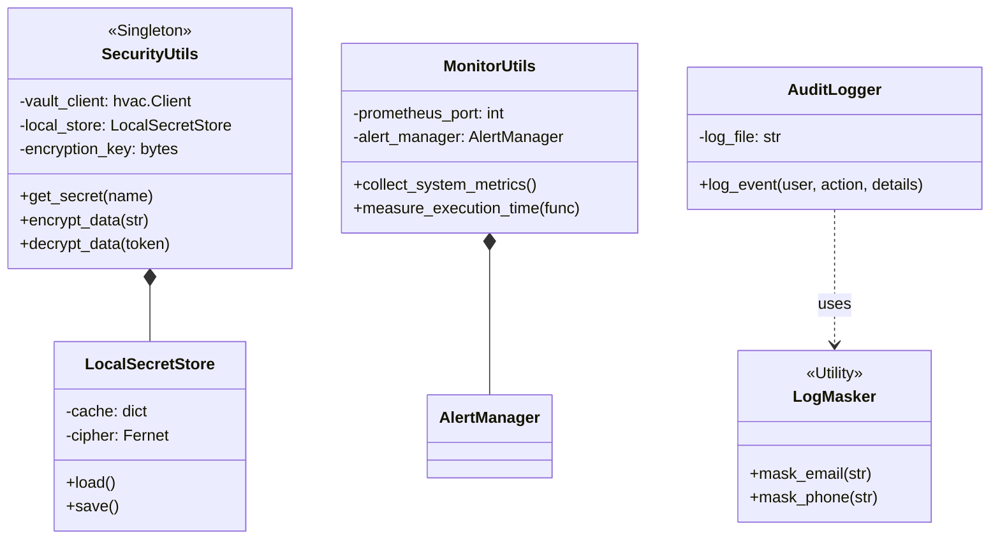

# System Design Document - SecurityMonitor

**Date:** 2025-12-25
**Author:** Gemini CLI Agent

## Module 2: General Security & Monitoring Toolset (`security_monitor`)

### 1. Architecture Overview
This module is designed as a **Cross-Cutting Concern** library. It does not run as a separate process but is injected into the host application runtime. It uses the **Singleton Pattern** for configuration management to ensure consistent security context across the application.

#### 1.1 Class Diagram

### 2. Detailed Component Design

#### 2.1 Security Context (`SecurityUtils`)
*   **Initialization Strategy:**
    *   The `initialize_security()` factory function determines the mode (Dev vs. Prod).
    *   **Prod Mode:** Connects to HashiCorp Vault. Requires `VAULT_ADDR` and `VAULT_TOKEN`.
    *   **Dev Mode:** Falls back to `LocalSecretStore`. If the master key is missing, it generates a transient one (warning the user).
*   **Secret Resolution Logic:**
    *   Input: `path:key` (e.g., `database/creds:password`).
    *   **Vault:** Splits path and key. Calls `client.secrets.kv.v2.read_secret_version(path)`.
    *   **Local:** Flattens to `database/creds:password` string and looks up in the JSON dictionary.

#### 2.2 Observability (`MonitorUtils`)
*   **Prometheus Integration:**
    *   Starts a lightweight HTTP server (default port 8000) on a separate thread (daemonized).
    *   Exposes `/metrics` endpoint.
    *   **Standard Metrics:**
        *   `request_processing_seconds` (Summary): Histogram of function latencies.
        *   `system_cpu_usage_percent` (Gauge): Snapshot of OS health.
        *   `api_errors_total` (Counter): Monotonic count of failures.

#### 2.3 Compliance Logging (`AuditLogger`)
*   **Immutability:** The logger opens the file in append-mode (`"a"`) for every write operation. It never uses write-mode (`"w"`), preserving history.
*   **Sanitization (`LogMasker`):**
    *   **Recursive Masking:** If the details object is a nested dictionary, the masker recurses through it.
    *   **Regex Strategy:**
        *   *Email:* `(?P<prefix>[\w\.-]+)@(?P<domain>[\w\.-]+)` -> `e***t@domain.com`.
        *   *Phone:* `(?<!\w)(\+?[\d\s-]{10,})(?!\w)` -> `***-1234`.

### 3. Security Considerations
*   **Key Management:** The Master Encryption Key (used for Local Store and `fernet` encryption) must be injected via Environment Variable (`ENCRYPTION_KEY`) in production.
*   **Fail-Open vs. Fail-Closed:**
    *   If Vault is unreachable, `get_secret` returns `None`. The application is expected to handle this (Fail-Closed) rather than crashing immediately, allowing for graceful degradation or retries.
*   **Performance:**
    *   `LogMasker` uses compiled Regex patterns. However, logging massive objects (MBs in size) will incur CPU overhead due to recursive traversal.
